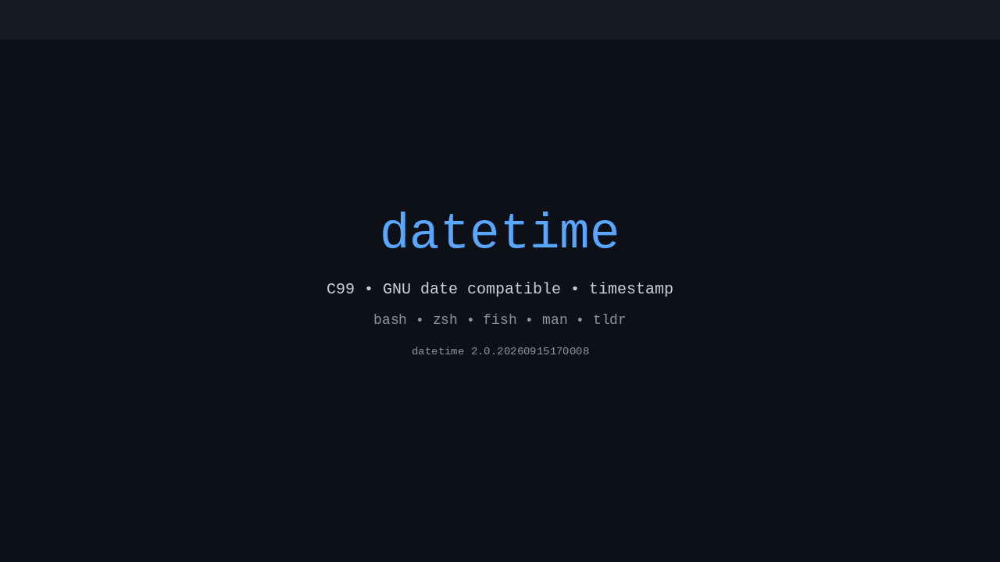

# datetime

A small C99 program that prints the current datetime, computed in the host machine's timezone or UTC, with full GNU `date` compatible options. Extends the original legacy formats with GNU `date` semantics (`-d`, `-f`, `-I`, `-R`, `--rfc-3339`, `-r`, `-s`, `-u`, `--debug`, `--resolution`, and custom `+FORMAT`).

Legacy formats are kept for backward compatibility; new options follow the GNU `date` interface.

> **Scope:** **22** long options (`--date`, `--debug`, `--file`, `--iso-8601`, `--resolution`, `--rfc-email`, `--rfc-3339`, `--reference`, `--set`, `--utc`/`--universal`, `--help`, `--version`, `--timestamp` + 9 legacy) + **15** short options + **47** `+FORMAT` sequences (`%%`..`%Z`, flags `-_0+^#`, width, `E`/`O`) — **30+** distinct invocations, all shown below.

# timestmap 

A small C99 programm that prints the current UTC datetime in the format: YYYYMMDDhhmmssZ

## Example usage of datetime and timestamp



> Animated demo — `showcase.gif` generated from the examples below via `python3 scripts/gen-showcase-gif.py` (102 frames, 1280×720, 1.4 MB, also `showcase.mp4`).

Extensive examples covering every option and `FORMAT` - all are tested in `tests/_test_datetime:1`, `tests/_test_combinatorial:1`, `tests/test_exhaustive.py:1`.

### Basic and version/help
```sh
./datetime                          # default: 20260909103730 (YYYYMMDDhhmmss)
./datetime --help                   # full help
./datetime -h                       # same as --help
./datetime --version                # datetime 2.0.20260909083730Z + Timezone: CEST (UTC+2)
./datetime -V                       # same as --version
./datetime --debug -d "2020-01-02" +"%F"  # debug to stderr: parsing + format decisions
./timestamp                         # default: 20260909103730Z (UTC YYYYMMDDhhmmssZ)
./timestamp --help                  # same options as datetime, default is UTC stamp
./timestamp -h                      # same as --help
./timestamp --version               # timestamp 2.0.20260909083730Z
```

### Legacy output formats
```sh
./datetime -hr              # 2026-09-09 10:37:30 (human readable)
./datetime --human-readable # same
./datetime -c               # 20260909T103730 (compact, ISO 8601 basic)
./datetime --compact
./datetime iso-basic        # same as -c (without dash)
./datetime -cd              # 2026-09-09
./datetime --calendar-date
./datetime -cdb             # 20260909
./datetime --calendar-date-base
./datetime -od              # 2026-252 (ordinal, DDD 001..366)
./datetime --ordinal-date
./datetime -odb             # 2026252
./datetime --ordinal-date-base
./datetime -wd              # 2026-W37-3 (ISO week, 1=Mon..7=Sun)
./datetime --week-date
./datetime -wdb             # 2026W373
./datetime --week-date-basic
./datetime --timestamp      # 20260909103730Z (UTC, micro-version format)
```

### GNU date compatible
```sh
./datetime -d "@0" +"%F %T"                 # epoch 0 UTC -> 1970-01-01 01:00:00 (local) / 00:00:00 with -u
./datetime -u -d "@0" +"%F %T %Z"           # 1970-01-01 00:00:00 UTC
./datetime -d "@2147483647" -u +"%F %T"     # 2038-01-19 03:14:07 (32-bit max)
./datetime -d "@1234567890.123456789" -u +"%s.%N" # fractional epoch with nanoseconds
./datetime -d "2020-01-02" +"%F"            # 2020-01-02
./datetime -d "2020-01-02 03:04:05" +"%F %T"
./datetime -d "2020/01/02" +"%F"
./datetime -d "01/02/20" +"%F"              # MM/DD/YY
./datetime -d "now" +"%F %T"
./datetime -d "today" +"%F"
./datetime -d "yesterday" +"%F"
./datetime -d "tomorrow" +"%F"
./datetime -d "TZ=\"UTC\" 2020-01-02 03:04:05" -u +"%T" # TZ prefix: parse in UTC
./datetime -d 'TZ="America/Los_Angeles" 09:00 next Fri' +"%F %a" # relative + TZ
```

### File and reference
```sh
printf "2020-01-02\n2020-01-03\n" > dates.txt
./datetime -f dates.txt +"%F"              # each line as --date
./datetime --file=dates.txt +"%F"
printf "2020-01-02\n" | ./datetime -f - +"%F"  # stdin via -
touch -d "2020-01-02 03:04:05" ref
./datetime -r ref +"%F %T"                 # last modification time
./datetime --reference=ref +"%F"
```

### ISO-8601 / RFC / resolution / UTC
```sh
./datetime -I                  # 2026-09-09 (date, default)
./datetime --iso-8601          # same
./datetime -Ihours             # 2026-09-09T10+02:00
./datetime --iso-8601=minutes  # 2026-09-09T10:37+02:00
./datetime -Iseconds           # 2026-09-09T10:37:30+02:00
./datetime --iso-8601=ns       # 2026-09-09T10:37:30.123456789+02:00
./datetime -u -Iseconds        # +00:00 in UTC
./datetime -R                  # Wed, 09 Sep 2026 10:37:30 +0200 (RFC 5322)
./datetime --rfc-email
./datetime --rfc-3339=date     # 2026-09-09
./datetime --rfc-3339=seconds  # 2026-09-09 10:37:30+02:00
./datetime --rfc-3339=ns       # 2026-09-09 10:37:30.123456789+02:00
./datetime --resolution        # 0.000000001 (nanosecond)
./datetime -u +"%Y-%m-%d %H:%M:%S %Z"  # UTC mode
./datetime --utc +"%F"
./datetime --universal +"%Z"   # alias of -u
```

### Custom FORMAT (all GNU sequences, flags, width, modifiers)
```sh
./datetime -d "2020-01-02" +"%a %A %b %B %c"   # Thu Thursday Jan January ...
./datetime -d "2020-01-02" +"%C %d %D %e %F"   # 20 02 01/02/20  2 2020-01-02
./datetime -d "2020-01-02" +"%g %G %h %H %I"   # 20 2020 Jan 00 12
./datetime -d "2020-01-02" +"%j %k %l %m %M"   # 002  0 12 01 00
./datetime -d "2020-01-02" +"%n %N %p %P %q"   # newline 000000000 AM am 1
./datetime -d "2020-01-02" +"%r %R %s %S"      # 12:00:00 AM 00:00 1577919600 00
./datetime -d "2020-01-02" +"%t %T %u %U %V"   # tab 00:00:00 4 00 01
./datetime -d "2020-01-02" +"%w %W %x %X %y"   # 4 00 01/02/20 00:00:00 20
./datetime -d "2020-01-02" +"%Y %z %:z %::z %:::z %Z" # 2020 +0100 +01:00 +01:00:00 +01 CET
./datetime +"%Y-%m-%d %H:%M:%S.%N %z"         # nanoseconds + zone
# flags / width / modifiers
./datetime -d "2020-01-02" +"%_d"    # ' 2' space pad
./datetime -d "2020-01-02" +"%05d"   # '00002' zero pad width 5
./datetime -d "2020-01-02" +"%-5d"   # '2    ' no pad width 5
./datetime -d "2020-01-02" +"%^A"    # THURSDAY upper
./datetime -d "2020-01-02" +"%#A"    # opposite case
./datetime -d "2020-01-02" +"%+4Y"   # '+2020' plus for >4 digits
./datetime -d "2020-01-02" +"%10Y"   # '      2020' width 10
./datetime -d "2020-01-02" +"%Ey"    # alternative representation
./datetime -d "2020-01-02" +"%OY"    # alternative numeric
./datetime +"%Y%%m"                 # 2026%m (%% -> %)
./datetime -u -d "@0" +"%s.%N"      # 0.000000000
```

### Set time (requires root, otherwise warns but prints)
```sh
sudo ./datetime -s "2020-01-02 00:00:00"       # set system time
sudo ./datetime --set="2020-01-02" --debug    # with debug
./datetime 09091100                          # MMDDhhmm positional -> set Sep 09 11:00
./datetime 0909110000.00                     # MMDDhhmmYY.ss
```

### Error and exclusivity (mutually exclusive: `--date/--file/--reference/--resolution`)
```sh
./datetime -d "now" --file dates.txt         # fails: mutually exclusive
./datetime -d "now" -r ref --resolution      # fails
./datetime --iso-8601=invalid                # fails: invalid FMT
./datetime -d --file                         # fails: missing arg
./datetime --unknown                         # fails: unknown option
