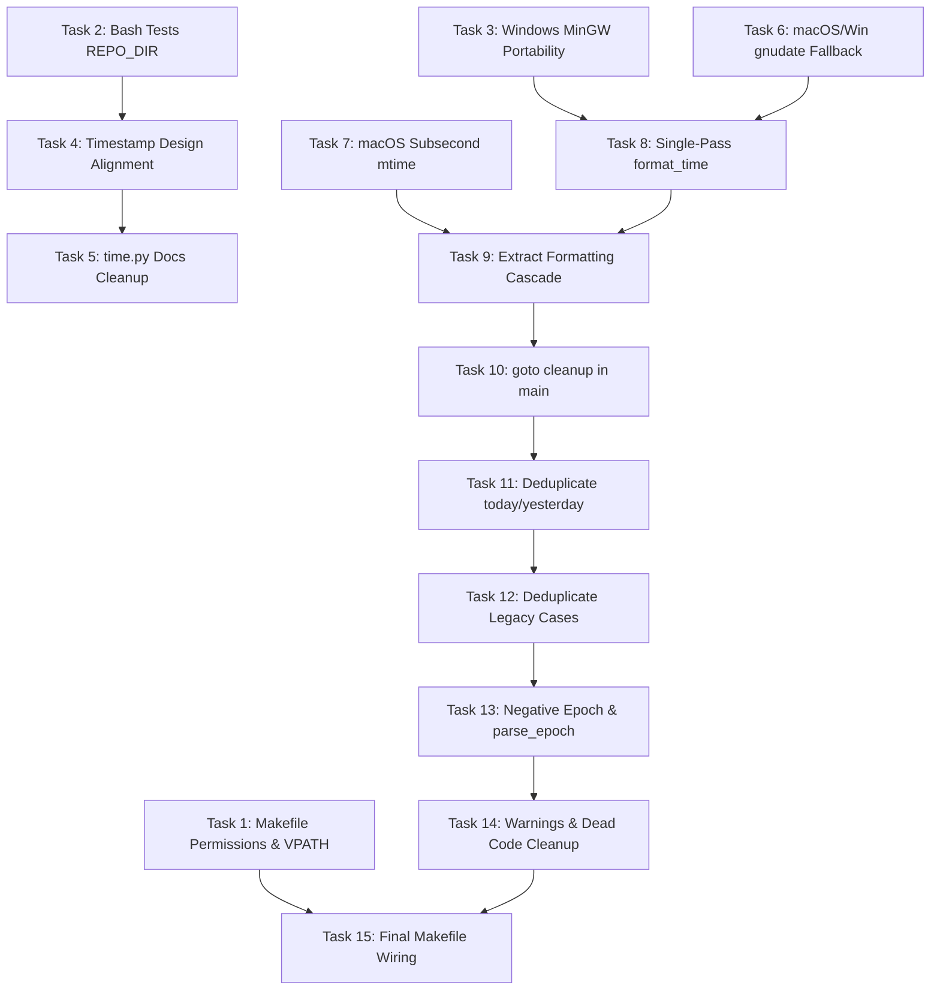

# Implementation Plan: datetime Optimization, Simplification & Portability

> **Execution Guide:** This plan implements the optimizations, simplifications, and cross-platform fixes detailed in [`suggestions_agy.md`](suggestions_agy.md). Steps use checkbox (`- [ ]`) syntax for progress tracking.

**Goal:** Modernize and simplify `datetime.c` and `Makefile` to produce clean, C99/GNU-compliant, warning-free code that compiles and runs identically across Linux, macOS, and Windows (MinGW/MSYS2), with 100% test passage and synchronized documentation.

**Tech Stack:** C99, GNU Make, Bash, Python 3 / Pytest, Valgrind.

---

## Global Constraints & Conventions

* **C Standard:** Strict C99 with standard POSIX/GNU extensions (`_GNU_SOURCE`, `_DEFAULT_SOURCE`, `_POSIX_C_SOURCE 200809L`).
* **Platform Portability:** Zero compilation warnings under GCC and Clang with `-O2 -Wall -Wextra -std=c99` on Linux, macOS (Darwin), and Windows (MinGW-w64).
* **Testing:** All 406 bash checks and 40 Python tests (244 subtests) must pass.
* **Documentation Integrity:** Preserve existing option contracts, update stale references (`time.py`, symlink documentation), and keep help files ESC-free.

---

## Phase 1: Critical Fixes & Makefile Corrections (P0)

### Task 1: Fix Makefile Install Permissions, VPATH, and Dist Target

**Files:**
- Modify: [`Makefile:7-35, 85-105, 117-148, 169-178, 208-212`](Makefile)

**Interfaces / Changes:**
- Separate `all` from `install`: `all: $(TARGETS)`.
- Make `mandir` and `man1dir` respect user-local `bindir`/`prefix` (e.g. `$(HOME)/.local/share/man`).
- Fix `dist` target destination: copy files into `$$dir/` and depend explicitly on `version.h`.
- Fix double-path `$(srcdir)/$(SRC)` in compile recipes.
- Remove circular dependency rule `Makefile: $(srcdir)/Makefile`.
- Use forward slashes for Windows uninstall path.

- [x] **Step 1: Update Makefile target and path definitions**
  - Change `all: $(TARGETS) install` to `all: $(TARGETS)`.
  - Fix recipe lines 95 and 98: change `$(srcdir)/$(SRC)` to `$(SRC)`.
  - Delete lines 208-210 (`Makefile: $(srcdir)/Makefile @true`).
  - Fix `dist` recipe: change `cp -p ... 2>/dev/null` to `cp -p $(SRC) $(srcdir)/Makefile $(srcdir)/README.md $(srcdir)/project.toml $(srcdir)/manual.texi $(srcdir)/NEWS $(srcdir)/ChangeLog $$dir/ 2>/dev/null || true;`.
  - Add `version.h` to `dist` dependencies: `dist: version.h $(SRC) ...`.
  - Fix `man1dir` assignment so if `PREFIX` or `bindir` is within `$(HOME)`, `man1dir` defaults to `$(HOME)/.local/share/man/man1` or install is guarded with `-@`.

- [x] **Step 2: Verify `make` and `make dist` as non-root user**
  - Run: `make clean && make`
  - Expected: Compiles `datetime` and `timestamp` without permission errors.
  - Run: `make dist`
  - Expected: Creates valid `datetime-2.0.<build>.tar.gz` containing all source files.

---

### Task 2: Fix Bash Test Suites (`REPO_DIR` Export)

**Files:**
- Modify: [`tests/_test_datetime:5-7`](tests/_test_datetime)
- Modify: [`tests/_test_combinatorial:7-9`](tests/_test_combinatorial)

- [x] **Step 1: Export `REPO_DIR` in both test suites**
  - In `tests/_test_datetime`:
    ```bash
    REPO_DIR=$(cd "$(dirname "${BASH_SOURCE[0]}")/.." && pwd)
    export REPO_DIR
    ```
  - In `tests/_test_combinatorial`:
    ```bash
    REPO_DIR=$(cd "$(dirname "${BASH_SOURCE[0]}")/.." && pwd)
    export REPO_DIR
    ```

- [x] **Step 2: Run both bash test suites**
  - Run: `./tests/_test_datetime`
  - Expected: `Summary: 122 passed, 0 failed, 122 total`.
  - Run: `./tests/_test_combinatorial`
  - Expected: `Summary: 284 passed, 0 failed, 284 total`.

---

### Task 3: Fix MinGW-w64 Portability in `datetime.c`

**Files:**
- Modify: [`datetime.c:7-11, 93-101, 887-900`](datetime.c)

**Interfaces / Changes:**
- Include `<getopt.h>` on MinGW-w64 (do not skip when `_WIN32` is defined).
- In `print_timezone()`, guard `ti->tm_zone` and `ti->tm_gmtoff` with `#ifdef _WIN32` and use `_timezone` / `_tzname`.
- In `format_time()`, compute timezone offset using `-_timezone` on Windows instead of `tm.tm_gmtoff`.

- [x] **Step 1: Update header inclusions in `datetime.c`**
  ```c
  #ifdef _WIN32
  #include <windows.h>
  #endif
  #include <getopt.h>
  ```

- [x] **Step 2: Add portable timezone offset helper**
  - Replace direct access to `tm.tm_gmtoff` with portable `_timezone` / `tm_gmtoff`.
  - Use in `print_timezone()` and `format_time()`.

- [x] **Step 3: Verify syntax check**
  - Run: `make check-syntax`
  - Expected: Pass with no compilation errors.

---

## Phase 2: Design Alignment & Documentation Synchronization (P1)

### Task 4: Align Timestamp Personality Design & Documentation

**Files:**
- Modify: [`README.md:350-353, 450-475`](README.md)
- Modify: [`project.toml:11-13`](project.toml)
- Modify: [`tests/_test_datetime:96-98`](tests/_test_datetime)
- Modify: [`tests/_test_combinatorial:239-242`](tests/_test_combinatorial)

**Context:**
`is_timestamp_binary()` was intentionally removed for GNU Coding Standards §17 compliance (*behavior must not depend on `argv[0]`*). The codebase provides `--timestamp` and `-DTIMESTAMP` compile-time personality.

- [x] **Step 1: Synchronize `README.md` and `project.toml`**
  - Update `README.md` to document that `timestamp` is compiled with `-DTIMESTAMP` (or invoked via `datetime --timestamp`). Remove stale `ln -sf` symlink claims.
  - Update `project.toml` `secondary_output` description to match compile-time `-DTIMESTAMP`.

- [x] **Step 2: Align test assertions**
  - Update `tests/_test_datetime` and `tests/_test_combinatorial` timestamp checks to test:
    1. `"$BIN" --timestamp` -> `^[0-9]{14}Z$`
    2. `"$REPO_DIR/timestamp"` -> `^[0-9]{14}Z$`

- [x] **Step 3: Run test suites to verify**
  - Run: `./tests/_test_datetime && ./tests/_test_combinatorial`
  - Expected: 100% PASS.

---

### Task 5: Clean Up Deleted `time.py` References

**Files:**
- Modify: [`README.md:454, 464, 479-483, 504`](README.md)
- Modify: [`project.toml:51`](project.toml)

- [x] **Step 1: Update Python one-liners in `README.md`**
  - Replace `import time; time.timestamp_get_for_microversion()` with standard library:
    ```sh
    python3 -c "import datetime; print(datetime.datetime.now(datetime.timezone.utc).strftime('%Y%m%d%H%M%SZ'))"
    ```
  - Remove deleted `time.py` references from `project.toml`.

---

### Task 6: Fix `parse_via_gnudate` Fallback for macOS and Windows

**Files:**
- Modify: [`datetime.c:532-565`](datetime.c)

- [x] **Step 1: Add OS-aware date command selection**
  - On macOS (`__APPLE__`), use `gdate` if available, otherwise fall back to BSD `date -j -f`.
  - On Windows (`_WIN32`), do not prepend `LC_ALL=C` (which fails in `cmd.exe`).

- [x] **Step 2: Test date parsing fallback**
  - Run: `./datetime -d "next Friday" +"%Y-%m-%d"`
  - Expected: Returns valid date on systems with GNU date or gdate.

---

### Task 7: Restore Sub-second Precision for File Reference on macOS

**Files:**
- Modify: [`datetime.c:1855-1866`](datetime.c)

- [x] **Step 1: Update platform guard for `st_mtimespec`**
  - Change `#ifdef __linux__` to `#if defined(__linux__) || defined(__APPLE__)`.
  - Ensure `st_mtimespec.tv_nsec` is read on macOS.

---

## Phase 3: Core C Simplification & Deduplication (P1/P2)

### Task 8: Single-Pass `format_time` Rewrite

**Files:**
- Modify: [`datetime.c:762-992`](datetime.c)

**Interfaces / Changes:**
- Replace 3-pass buffer rewriting (`fmt2[8192]`, `fmt3[8192]`) with a single pass emitting directly into `out`.
- Remove 16 KB stack allocation.
- Inline handle `%N`, `%q`, `%s`, and the `%z` family (`%z`, `%:z`, `%::z`, `%:::z`).
- Compute `struct tm` once.
- Eliminate unreachable dead `%s` check (lines 979-990).
- Eliminate `-Wformat-truncation` warnings.

- [x] **Step 1: Implement single-pass format loop**
  ```c
  static int
  format_time (const struct timespec *ts, const char *fmt, int utc, char *out, size_t outsz)
  ```
  - Walks `fmt` once, copies literal characters or formats converted values directly to `out`.
  - Delegates standard strftime tokens efficiently or evaluates inline.

- [x] **Step 2: Verify format accuracy across all specifiers**
  - Run: `python3 -m pytest tests/test_exhaustive.py -k test_format -v`
  - Expected: All 244 subtests PASS.
  - Run: `make check-syntax`
  - Expected: 0 warnings, no format truncation warnings.

---

### Task 9: Deduplicate Output Formatting Cascade in `main()`

**Files:**
- Modify: [`datetime.c:1580-1665, 1880-1953`](datetime.c)

**Interfaces / Changes:**
- Extract common formatting cascade into:
  ```c
  struct format_options {
    const char *iso_fmt;
    const char *rfc3339_fmt;
    int rfc_email;
    const char *custom_fmt;
    const char *legacy_fmt;
    int use_timestamp;
    int utc;
  };

  static int
  format_datetime_output (const struct timespec *ts,
                          const struct format_options *opts,
                          char *out, size_t outsz);
  ```
- Use `format_datetime_output()` in both `-f FILE` loop and single-date display.

- [x] **Step 1: Implement `format_datetime_output()` helper**
- [x] **Step 2: Replace duplicate blocks in `file_path` loop and single-date block**
- [x] **Step 3: Verify single date and file mode**
  - Run: `./datetime -Iseconds`
  - Run: `printf "2020-01-02\n2020-01-03\n" | ./datetime -f - -Iseconds`
  - Expected: Both produce matching format.

---

### Task 10: Replace Repetitive Cleanups with `goto cleanup` in `main()`

**Files:**
- Modify: [`datetime.c:1015-2000`](datetime.c)

- [x] **Step 1: Consolidate cleanup label at the end of `main()`**
  ```c
  cleanup:
    free (filtered_argv);
    free (date_str);
    free (file_path);
    free (reference_path);
    free (iso_fmt);
    free (rfc3339_fmt);
    free (set_str);
    free (custom_fmt);
    return exit_code;
  ```
- [x] **Step 2: Replace ~10 repeated free blocks with `exit_code = ...; goto cleanup;`**
- [x] **Step 3: Run memory check**
  - Run: `make check-mem`
  - Expected: 0 leaks across all execution and error paths.

---

### Task 11: Deduplicate `today` / `yesterday` / `tomorrow`

**Files:**
- Modify: [`datetime.c:672-727`](datetime.c)

- [x] **Step 1: Extract `parse_day_offset()` helper**
  ```c
  static int
  parse_day_offset (int day_delta, struct timespec *out, int utc)
  {
    time_t now = time (NULL);
    struct tm tm;
    if (utc)
      gmtime_r (&now, &tm);
    else
      localtime_r (&now, &tm);
    tm.tm_hour = 0;
    tm.tm_min = 0;
    tm.tm_sec = 0;
    tm.tm_isdst = -1;
    time_t t = utc ? timegm (&tm) : mktime (&tm);
    t += (time_t) day_delta * 86400;
    out->tv_sec = t;
    out->tv_nsec = 0;
    return 1;
  }
  ```
- [x] **Step 2: Call helper for `"today"` (0), `"yesterday"` (-1), `"tomorrow"` (+1)**
- [x] **Step 3: Run pytest suite to verify**
  - Run: `pytest tests/test_granular.py -k "test_date_parsing" -v`
  - Expected: PASS.

---

### Task 12: Deduplicate Legacy Format Cases

**Files:**
- Modify: [`datetime.c:1234-1321`](datetime.c)

- [x] **Step 1: Extract `set_legacy_format()` helper**
  ```c
  static void
  set_legacy_format (const char *fmt, const char **legacy_fmt, int *use_timestamp,
                     char **iso_fmt, char **rfc3339_fmt, int *rfc_email, char **custom_fmt)
  ```
- [x] **Step 2: Replace cases 1006–1013 with helper calls**

---

### Task 13: Fix Negative Epoch Bug & Simplify Fractional Handling in `parse_epoch`

**Files:**
- Modify: [`datetime.c:374-450`](datetime.c)
- Modify: [`tests/test_granular.py:53-57`](tests/test_granular.py)

- [x] **Step 1: Correct negative fractional second math**
  - If `sec < 0` and fractional nanoseconds exist: adjust `sec = sec - 1; nsec = 1000000000L - nsec;`.
  - Simplify digit parsing loop into a clean 9-digit reader.
- [x] **Step 2: Add negative epoch test in `test_granular.py`**
  - Add test for `@-1` and `@-0.5`.
- [x] **Step 3: Verify tests**
  - Run: `pytest tests/test_granular.py -k test_format_epoch -v`
  - Expected: PASS.

---

### Task 14: Clean Up Compiler Warnings & Dead Code

**Files:**
- Modify: [`datetime.c:270-280, 301-322, 901, 1720-1730`](datetime.c)

- [x] **Step 1: Remove unused variables**
  - Remove unused `zcol3` (line 901).
  - Remove unused `cc`, `yy`, `ss` in MMDDhhmm parser (line 1721).
  - Replace `strncpy` with proper null-terminated digit extraction to prevent `-Wstringop-truncation`.
- [x] **Step 2: Remove redundant check in `shell_escape`**
  - Drop inner `if (j + 4 >= outsz) break;`.
- [x] **Step 3: Remove dead fallback in `get_current_timespec`**
- [x] **Step 4: Factor MMDDhhmm digit validation into `is_mmdd_format()`**
- [x] **Step 5: Simplify `print_usage` into single string block**
- [x] **Step 6: Verify zero warnings**
  - Run: `gcc -O2 -Wall -Wextra -std=c99 -fsyntax-only datetime.c`
  - Expected: 0 warnings.

---

## Phase 4: Final Integration, Test Wiring & Verification (P3)

### Task 15: Wire Test Suites into `make check` & Final Verification

**Files:**
- Modify: [`Makefile:195-207`](Makefile)

- [x] **Step 1: Add `check-test` target to Makefile**
  ```make
  check-test: $(TARGETS)
  	@./tests/_test_datetime
  	@./tests/_test_combinatorial
  	@if command -v python3 >/dev/null 2>&1; then \
  		python3 -m pytest tests/test_granular.py tests/test_exhaustive.py -v; \
  	fi

  check: check-syntax check-mem check-style check-test
  ```
- [x] **Step 2: Gracefully handle Valgrind on macOS in `check-mem`**
  - If `valgrind` not found on Darwin, echo informative skip notice instead of hard-failing.

- [x] **Step 3: Execute complete test battery**
  - Run: `make clean`
  - Run: `make`
  - Run: `make check-style`
  - Run: `make check`
  - Expected: All syntax checks, style checks, memory checks, and test suites PASS with 0 errors.

---

## Task Dependency Graph


